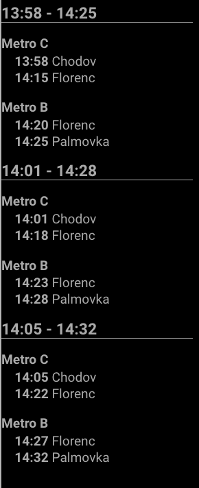

# MMM-PublicTransportPrague

This is a module for the [MagicMirror²](https://github.com/MichMich/MagicMirror/).

Display departures for public transport in Prague



## Using the module

To use this module, add the following configuration block to the modules array in the `config/config.js` file:

```
modules: [
  {
    module: 'MMM-PublicTransportPrague',
    config: {
      // See below for allconfigurable options
      from: 'Chodov',
      to: 'Palmovka'
    }
  }
]
```

## Configuration options

| Option           | Description
|----------------- |-----------
| `from`        | *Optional*
| `to`        | *Optional*
| `updateInterval` | *Optional* How often does the content needs to be fetched (ms)
| `retryDelay` | *Optional* The delay before retrying after a request failure (ms)